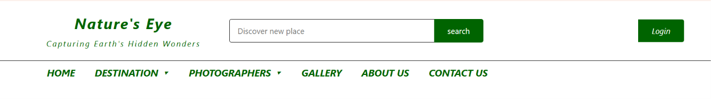
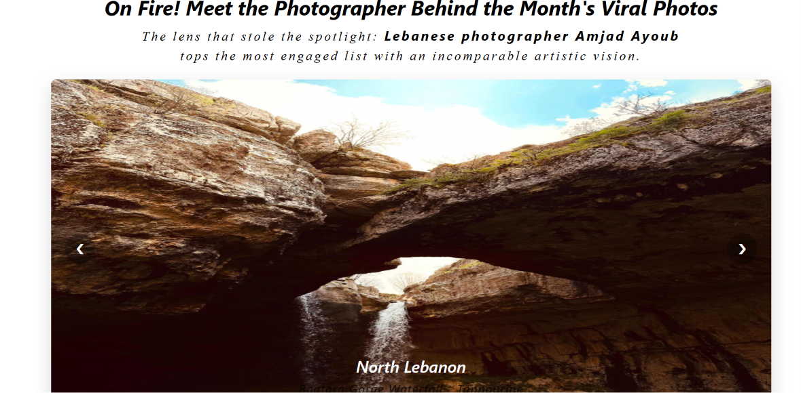
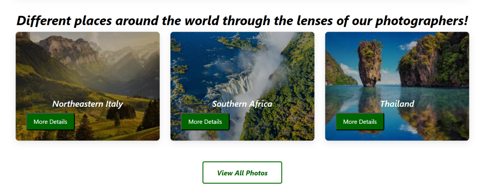
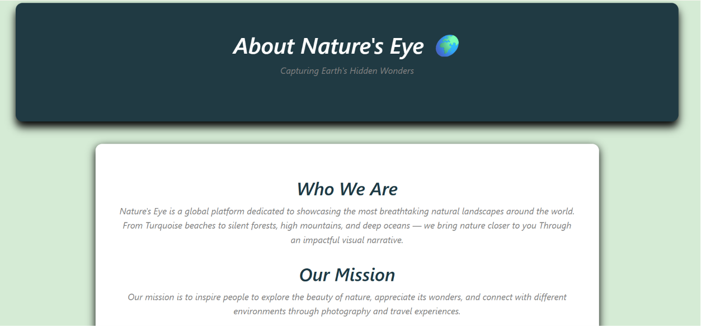
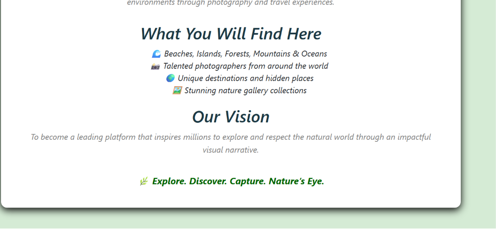
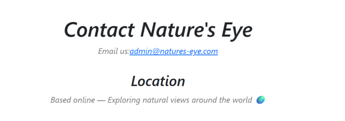
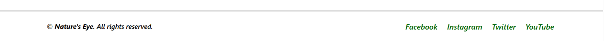

## Project Title 
Nature’s Eye
## Project description 
The Nature’s Eye website is a responsive web-based platform that operates on a client-side architecture. Users navigate through the platform using a responsive navigation bar, while a footer displays the website’s official social media accounts.
The application is structured into distinct, feature-specific sections:

###  Authentication
 **Login & Sign Up:** Handles secure user authentication, allowing users to create new accounts or log into existing profiles.

###  Core Content Pages
 **Home:** Highlights the "Photographer of the Month" (based on top user engagement), showcases the platform's most interacted-with photographs, and displays curated global imagery using modern, card-based UI layouts.
 **About Us:** Details the platform’s mission, user expectations, and the overarching vision for Nature's Eye.
 **Contact Us:** Features an integrated communication portal allowing users to reach out directly via email.

###  Future Roadmap (Upcoming Pages)
 **Destination:** A dedicated space to browse and filter various travel and geographic locations.
 **Photographer:** A directory highlighting the diverse network of photographers publishing their work on the platform.
 **Gallery:** A comprehensive visual archive displaying all uploaded images paired with their exact location names.
 ##  Setup Instructions

Follow these steps to run the project locally on your machine.

### Prerequisites
Make sure you have a modern web browser installed.

### Installation & Local Run
1. **Clone the repository:**
   ```bash
   git clone https://github.com
   ```
2. **Navigate into the project directory:**
   ```bash
   cd p1
   ```
3. **Open the project:**
   * Double-click the `index.html` file to open it directly in your browser.
   * *Alternatively*, if using VS Code, right-click `index.html` and select **Open with Live Server**.
 ###  Desktop Layout
#### Header component

#### Home Page Part 1

#### Home Page Part 2

#### About Us Page part 1

#### About Us Page part 2

#### Contact Us Page 


#### Login Page

#### Sign up Page

#### Footer 


